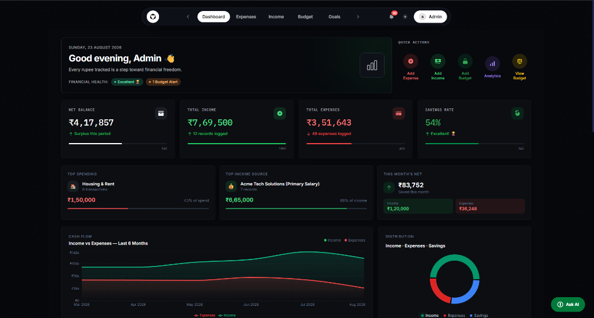
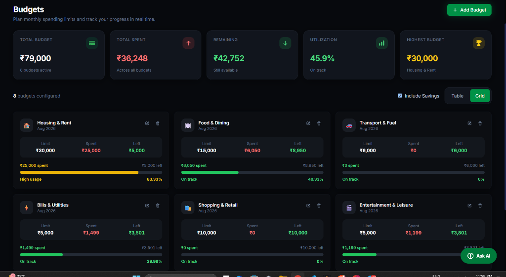
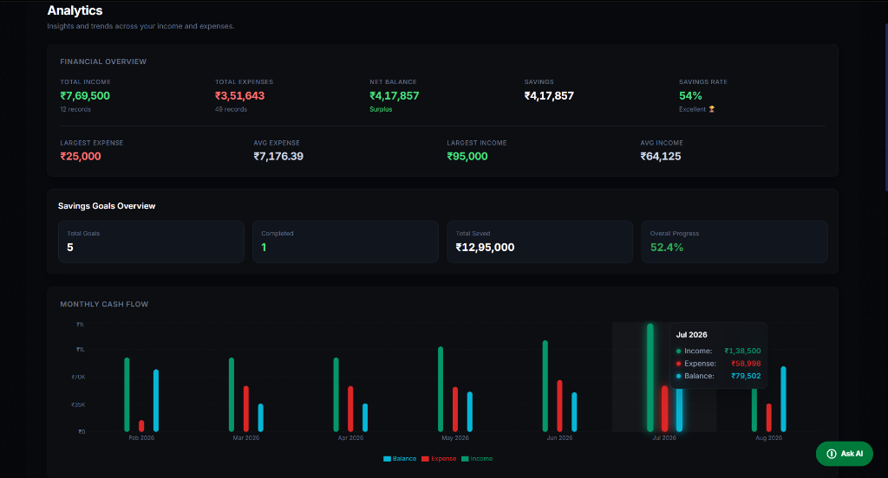
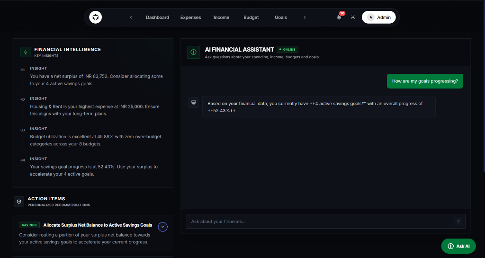
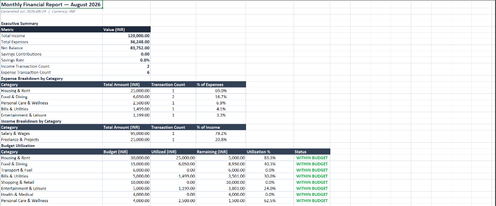
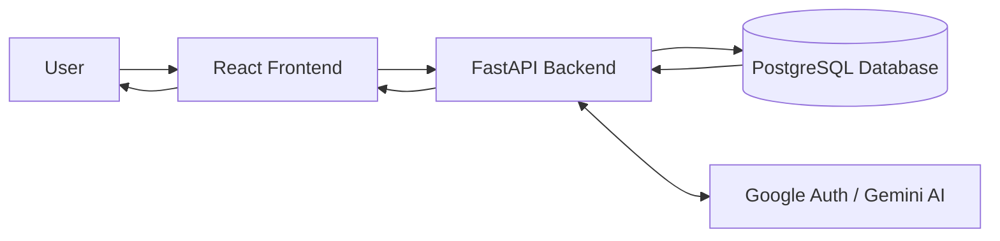

# Smart Expense Tracker



## Overview

Smart Expense Tracker is a production-grade, AI-powered personal finance application designed to provide a robust and secure way to manage your finances. It helps you track expenses, monitor income sources, set budget limits, and achieve financial goals, all visualized through an intuitive and modern dashboard. 

The application goes beyond simple tracking by integrating an **AI Financial Assistant** that provides personalized insights, smart summaries, and actionable recommendations based on your real-time financial data.

## Features & Screenshots

### Comprehensive Dashboard
Get a complete at-a-glance overview of your financial health. Track your net balance, total income, total expenses, savings rate, and recent cash flow trends in a beautiful dark-mode interface.


### Advanced Budget Management
Set category-based monthly budgets and track your utilization in real-time. The system automatically alerts you when you're approaching or exceeding your limits, helping you stay on track.


### Cash Flow Analytics
Visualize your income versus expenses over time. Dive deep into category breakdowns and savings rates with interactive charts to understand exactly where your money is going.


### AI Financial Assistant (Powered by Google Gemini)
Ask questions about your spending habits, get personalized financial insights, and receive smart recommendations on how to allocate surplus funds to your active savings goals.


### Automated Financial Reports
Generate comprehensive, categorized monthly financial reports in CSV/Excel formats for detailed record-keeping and external analysis.


## Technology Stack

The application is built using modern, industry-standard technologies to ensure high performance, security, and maintainability.

### Frontend
- **React 18** (Vite) for a fast, component-based UI
- **Tailwind CSS** for responsive, utility-first styling
- **React Router v6** for seamless client-side routing
- **Recharts** for interactive data visualization
- **Lucide React** for crisp, scalable iconography

### Backend
- **Python 3.12** with **FastAPI** & **Uvicorn** for high-performance async API handling
- **Pydantic** for rigorous data validation and serialization
- **SQLAlchemy** (async ORM) for robust database interactions
- **Google Gemini API** for generative AI financial insights

### Database & Security
- **PostgreSQL** (hosted via Supabase) for reliable relational data storage
- **Alembic** for seamless database schema migrations
- **JWT (JSON Web Tokens)** + **bcrypt** for secure, stateless session management
- **Google OAuth 2.0** integrated via a highly secure, PKCE-style stateless callback architecture

## Project Architecture

The system utilizes a decoupled frontend-backend architecture, communicating via a RESTful API with secure stateless authentication.



## Installation & Setup

### Prerequisites
- **Node.js** (v18+)
- **Python** (v3.12+)
- **PostgreSQL** instance (e.g., Supabase or local)

### Clone the Repository
```bash
git clone https://github.com/Aditya4860/smart-expense-tracker.git
cd smart-expense-tracker
```

### Backend Setup
```bash
cd backend
python -m venv .venv
# On Windows:
.venv\Scripts\activate
# On Linux/Mac:
# source .venv/bin/activate

pip install -r requirements.txt
```

Create an `.env` file in the `backend` directory:
```env
PROJECT_NAME="Smart Expense Tracker API"
SECRET_KEY="your_secure_secret_key"
DATABASE_URL="your_postgresql_database_url"
ALEMBIC_DATABASE_URL="your_postgresql_database_url"
BACKEND_CORS_ORIGINS=["http://localhost:5173","http://localhost:3000"]
FRONTEND_URL="http://localhost:3000"

# AI Integration
AI_PROVIDER="gemini"
GEMINI_API_KEY="your_gemini_api_key"

# Google OAuth
GOOGLE_CLIENT_ID="your_google_client_id.apps.googleusercontent.com"
GOOGLE_CLIENT_SECRET="your_google_client_secret"
```

Run database migrations and start the backend:
```bash
alembic upgrade head
uvicorn main:app --reload --port 8000
```

### Frontend Setup
In a new terminal:
```bash
cd frontend
npm install
npm run dev
```

The frontend will start at `http://localhost:3000`. 
