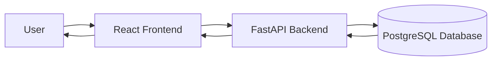

# Smart Expense Tracker

A full-stack personal finance application that helps you manage expenses, track income, set budgets, and achieve financial goals, all visualized through an intuitive dashboard.

## Overview

Smart Expense Tracker is a production-grade web application built to provide a robust and secure way to manage personal finances. It features a React 18 frontend with a responsive, modern UI and a FastAPI backend backed by PostgreSQL. The architecture relies on secure JWT authentication and a RESTful API design.

## Features

- **User Authentication**: Secure JWT-based login, registration, and session management.
- **Dashboard**: A comprehensive overview of your financial status with quick actions and recent transactions.
- **Expense Management**: Full CRUD operations for expenses with categorization and filtering.
- **Income Management**: Track various income sources easily.
- **Budget Management**: Set and monitor category-based monthly budgets with progress alerts.
- **Financial Goals**: Track savings goals with target amounts and deadlines.
- **Categories**: Customizable transaction categories with icons.
- **Reminders**: Schedule and manage important financial reminders.
- **Financial Analytics**: Visual cash flow and spending breakdowns using Recharts.
- **AI Assistant**: Conversational AI capabilities integrated directly into the application.
- **Responsive UI**: Fully responsive design with a clean card-based layout.
- **Data Persistence**: Asynchronous PostgreSQL database integration using SQLAlchemy.

## Technology Stack

### Frontend
- **React 18**
- **Vite**
- **Tailwind CSS**
- **React Router v6**
- **Recharts** for analytics
- **Lucide React** for icons

### Backend
- **Python 3.12**
- **FastAPI**
- **Uvicorn**
- **Pydantic**
- **SQLAlchemy** (async ORM)

### Database
- **PostgreSQL** (via Supabase)
- **Alembic** (migrations)

### Authentication
- **JWT (JSON Web Tokens)**
- **bcrypt** password hashing

## Project Architecture



## Project Structure

```text
expense-tracker/
├── backend/
│   ├── alembic/
│   ├── app/
│   │   ├── api/
│   │   ├── core/
│   │   ├── models/
│   │   ├── repositories/
│   │   └── services/
│   ├── main.py
│   └── requirements.txt
├── docs/
│   └── screenshots/
├── frontend/
│   ├── public/
│   ├── src/
│   │   ├── components/
│   │   ├── context/
│   │   ├── pages/
│   │   └── App.jsx
│   ├── package.json
│   └── tailwind.config.js
└── README.md
```

## Installation & Setup

### Prerequisites
- **Node.js** (v18+)
- **Python** (v3.12+)
- **PostgreSQL** instance (e.g., Supabase or local)

### Clone the Repository
```bash
git clone https://github.com/Aditya4860/smart-expense-tracker.git
cd smart-expense-tracker
```

### Backend Setup
```bash
cd backend
python -m venv .venv
# On Windows
.venv\Scripts\activate
# On Linux/Mac
# source .venv/bin/activate

pip install -r requirements.txt
```

Create an `.env` file in the `backend` directory based on `.env.example`:
```env
PROJECT_NAME="Smart Expense Tracker API"
SECRET_KEY=your_secret_key
DATABASE_URL=your_postgresql_database_url
ALEMBIC_DATABASE_URL=your_postgresql_database_url
BACKEND_CORS_ORIGINS=["http://localhost:5173","http://localhost:3000"]
AI_PROVIDER=gemini
GEMINI_API_KEY=your_gemini_api_key
```

Run database migrations:
```bash
alembic upgrade head
```

Start the backend:
```bash
uvicorn main:app --reload --port 8000
```

### Frontend Setup
In a new terminal:
```bash
cd frontend
npm install
npm run dev
```

The frontend will start at `http://localhost:5173` or `http://localhost:3000` (depending on port availability).

## API Documentation
The backend exposes comprehensive REST APIs documented automatically. Once the backend is running, access Swagger UI at:
- `GET http://127.0.0.1:8000/docs`

Major API Endpoints:
| Method | Endpoint | Description |
| ------ | -------- | ----------- |
| POST   | `/api/v1/auth/login` | Authenticate user |
| GET    | `/api/v1/expenses` | List expenses |
| POST   | `/api/v1/expenses` | Add new expense |
| GET    | `/api/v1/income` | List income sources |
| GET    | `/api/v1/budget` | Get budget data |
| GET    | `/api/v1/goals` | List financial goals |

## Database
- **Technology**: PostgreSQL
- **ORM**: SQLAlchemy
- **Main Entities**: Users, Categories, Expenses, Income, Budgets, Goals, Reminders.
- **Relationships**: Users own their categories, transactions, and goals ensuring secure data isolation.

## UI/UX
- **Dashboard-Oriented Interface**: Quick summaries and actionable insights immediately upon login.
- **Responsive Design**: Scales beautifully across devices using Tailwind CSS.
- **Data Visualization**: Interactive Recharts components for cashflow and category distribution.
- **Cards and Modals**: Clean segmentation of information and focused forms for data entry.

## Security
- **Authentication**: JWT access and refresh tokens.
- **Password Hashing**: Secure bcrypt hashing for passwords.
- **CORS Configuration**: Restricts access to allowed frontend origins.
- **Environment Variables**: Sensitive credentials and keys stored outside the source code.

## Future Improvements
- Mobile application (PWA)
- Advanced customizable reporting (PDF/CSV exports)
- Automated recurring transactions
- Improved AI-driven financial insights
