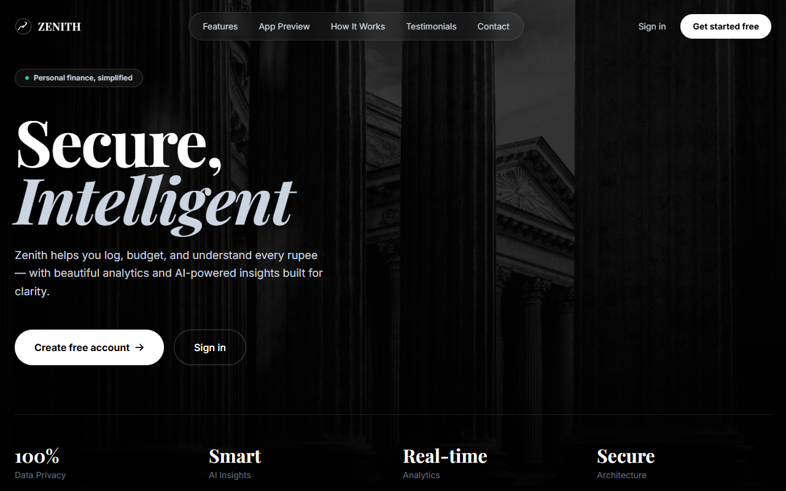
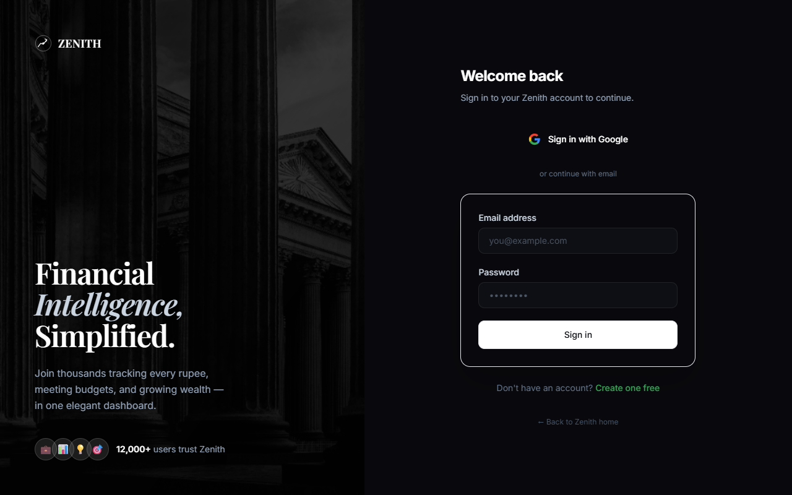
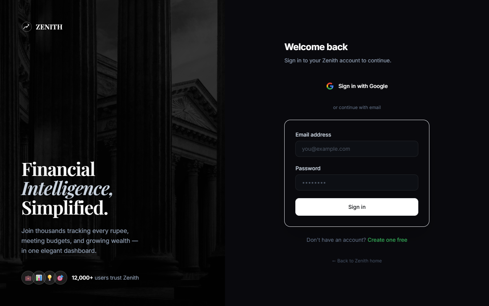
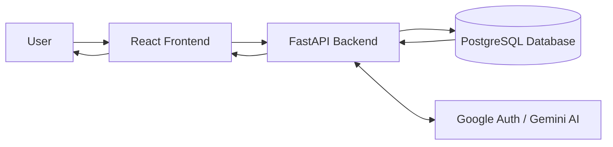

# Smart Expense Tracker

A full-stack personal finance application that helps you manage expenses, track income, set budgets, and achieve financial goals, all visualized through an intuitive dashboard.



## Overview

Smart Expense Tracker is a production-grade web application built to provide a robust and secure way to manage personal finances. It features a React 18 frontend with a responsive, modern UI and a FastAPI backend backed by PostgreSQL. The architecture relies on secure custom JWT authentication (with Google OAuth integration) and a highly performant RESTful API design.

## Key Features

- **Advanced Authentication**: 
  - Standard Email/Password with secure JWT-based session management.
  - **Google OAuth**: One-click "Sign in with Google" seamlessly integrated with a stateless PKCE-style callback that is highly secure and immune to `SameSite` browser cookie blocks.
- **AI Assistant**: Conversational AI capabilities integrated directly into the application using **Google Gemini AI**. Receive insights and smart financial summaries.
- **Financial Dashboard**: A comprehensive, at-a-glance overview of your financial status with actionable summaries and recent transactions.
- **Budgeting & Goals**: 
  - Set category-based monthly budgets with real-time visual progress alerts.
  - Track savings goals with target amounts and deadlines.
- **Cash Flow Analytics**: Visual cash flow and spending breakdowns using interactive Recharts components.
- **Comprehensive CRUD**:
  - Full management of income sources and categorized expenses.
  - Customizable transaction categories with rich icons.
- **Reminders**: Schedule and manage important financial reminders for bills and subscriptions.
- **Responsive & Modern UI**: Fully responsive, dark-mode native design with a clean card-based layout and animated transitions.

## Screenshots

### Dashboard


### Budget Utilization


### Expense Management


## Technology Stack

### Frontend
- **React 18** (Vite)
- **Tailwind CSS** for responsive styling
- **React Router v6** for client-side routing
- **Recharts** for beautiful data visualization
- **Lucide React** for crisp, scalable icons

### Backend
- **Python 3.12** with **FastAPI** & **Uvicorn**
- **Pydantic** for rigorous data validation
- **SQLAlchemy** (async ORM)
- **httpx** for external OAuth API calls

### Database & Security
- **PostgreSQL** (hosted via Supabase)
- **Alembic** (database migrations)
- **JWT (JSON Web Tokens)** + **bcrypt** password hashing

## Project Architecture



## Installation & Setup

### Prerequisites
- **Node.js** (v18+)
- **Python** (v3.12+)
- **PostgreSQL** instance (e.g., Supabase or local)

### Clone the Repository
```bash
git clone https://github.com/Aditya4860/smart-expense-tracker.git
cd smart-expense-tracker
```

### Backend Setup
```bash
cd backend
python -m venv .venv
# On Windows:
.venv\Scripts\activate
# On Linux/Mac:
# source .venv/bin/activate

pip install -r requirements.txt
```

Create an `.env` file in the `backend` directory:
```env
PROJECT_NAME="Smart Expense Tracker API"
SECRET_KEY="your_secret_key"
DATABASE_URL="your_postgresql_database_url"
ALEMBIC_DATABASE_URL="your_postgresql_database_url"
BACKEND_CORS_ORIGINS=["http://localhost:5173","http://localhost:3000"]
FRONTEND_URL="http://localhost:3000"

# AI Integration
AI_PROVIDER="gemini"
GEMINI_API_KEY="your_gemini_api_key"

# Google OAuth
GOOGLE_CLIENT_ID="your_google_client_id.apps.googleusercontent.com"
GOOGLE_CLIENT_SECRET="your_google_client_secret"
```

Run database migrations and start the backend:
```bash
alembic upgrade head
uvicorn main:app --reload --port 8000
```

### Frontend Setup
In a new terminal:
```bash
cd frontend
npm install
npm run dev
```

The frontend will start at `http://localhost:3000` or `http://localhost:5173`. 

## API Documentation
The backend exposes comprehensive REST APIs documented automatically. Once the backend is running, access Swagger UI at:
- `GET http://localhost:8000/docs`

Major API Endpoints:
| Method | Endpoint | Description |
| ------ | -------- | ----------- |
| POST   | `/api/v1/oauth/google/login` | Initiate Google OAuth Flow |
| POST   | `/api/v1/auth/login` | Authenticate standard user |
| GET    | `/api/v1/expenses` | List expenses |
| POST   | `/api/v1/expenses` | Add new expense |
| GET    | `/api/v1/budget` | Get budget data |
| GET    | `/api/v1/goals` | List financial goals |

## Future Improvements
- Mobile application (Progressive Web App)
- Advanced customizable reporting (PDF/CSV exports)
- Automated recurring transactions engine
