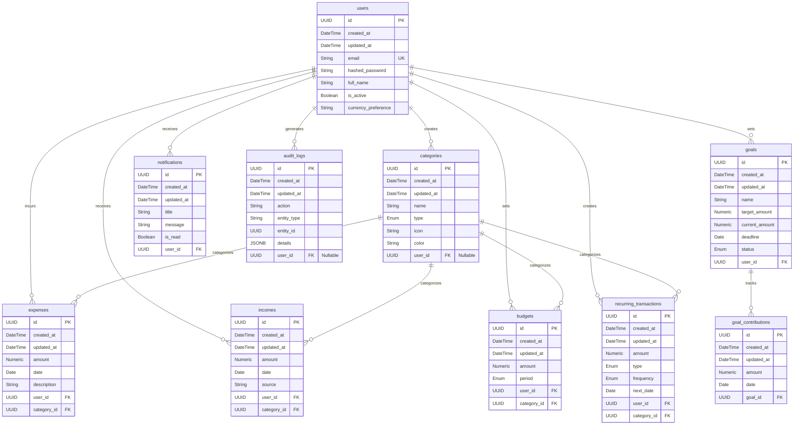

# Database Schema

This document contains the Entity Relationship (ER) diagram and table definitions for the Smart Expense Tracker backend.

## ER Diagram

## Indexes
- `users.email` (UNIQUE)
- `expenses.user_id`, `expenses.category_id`, `expenses.date`
- `incomes.user_id`, `incomes.category_id`, `incomes.date`
- `budgets.user_id`, `budgets.category_id`
- `recurring_transactions.user_id`, `recurring_transactions.next_date`
- `audit_logs.entity_type`, `audit_logs.entity_id`

## Constraints
- Unique constraint on `budgets`: `(user_id, category_id, period)`
- Foreign keys with `ON DELETE CASCADE` generally, except for Categories which restricts deletion if assigned (`ON DELETE RESTRICT`).
